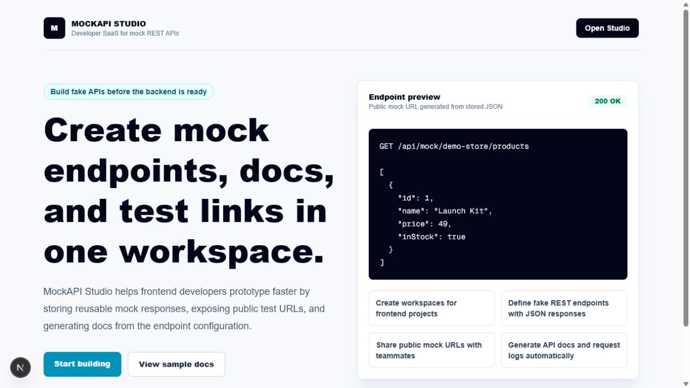
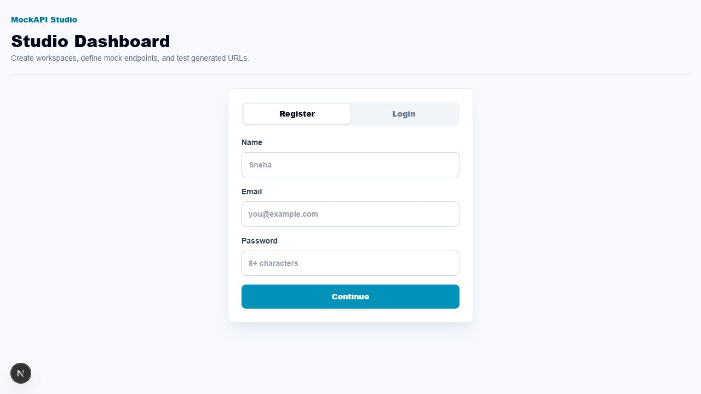
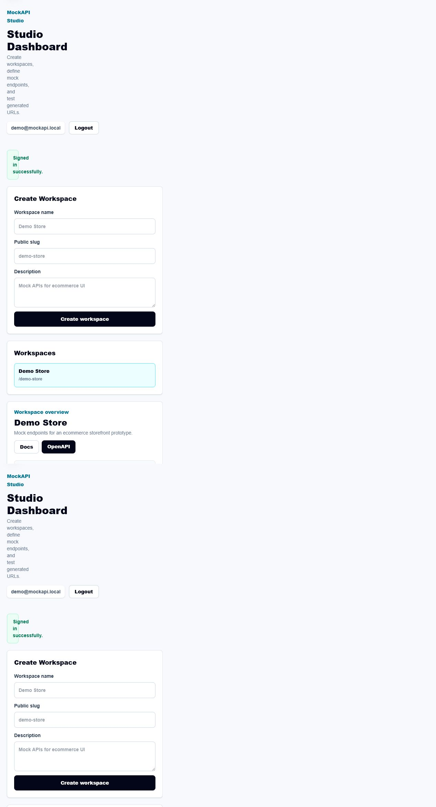
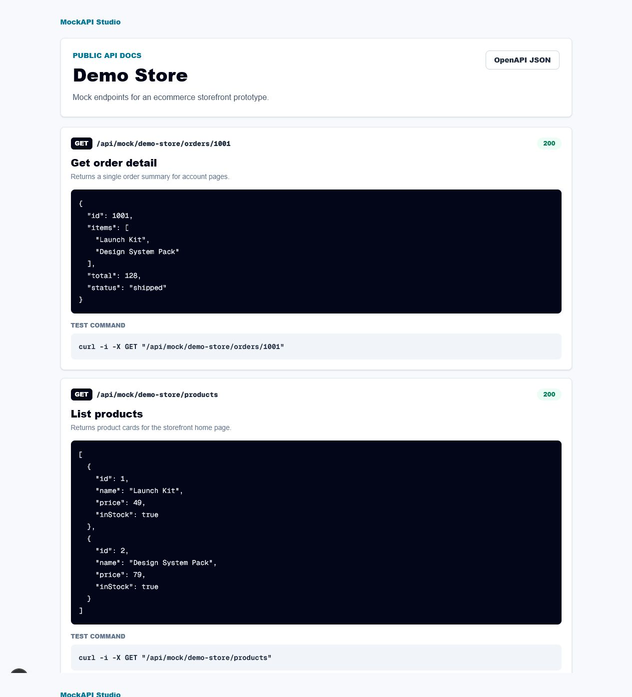

# MockAPI Studio

MockAPI Studio is a full-stack developer SaaS project where frontend developers can create fake REST API endpoints, store JSON responses, share public test URLs, view generated API docs, and inspect request history.

**In plain words:** normally a frontend developer has to wait for the backend team to finish building an API before they can build and test their screens. MockAPI Studio lets them skip that wait — they type in what a fake API response should look like, click save, and instantly get a real URL that returns exactly that JSON. No backend, no database setup, no waiting.

Repository: [snehaprasad11/MockAPI_Studio](https://github.com/snehaprasad11/MockAPI_Studio)


## Demo Video

[Watch the MockAPI Studio demo video](docs/demo/mockapi-studio-demo.mp4)

The demo covers the landing page, authentication, workspace creation, endpoint builder, JSON/status/delay/error settings, public mock URLs, dashboard metrics, request history, generated docs, OpenAPI export, optional Ollama generation, and MySQL persistence.

## Screenshots

| Landing Page | Register / Login |
| --- | --- |
|  |  |

| Studio Dashboard | Public API Docs |
| --- | --- |
|  |  |

## Why This Exists

Frontend teams often wait for backend endpoints before they can finish screens, API states, loading flows, and error states. MockAPI Studio solves that by letting developers define mock endpoints in a workspace and instantly test them through public URLs.

Example:

```text
GET /api/mock/demo-store/products
```

Returns:

```json
[
  {
    "id": 1,
    "name": "Launch Kit",
    "price": 49,
    "inStock": true
  }
]
```

## Features

- User registration and login with cookie-based sessions.
- Per-IP rate limiting on login and registration to slow brute-force attempts.
- Workspace creation for projects or frontend features.
- Mock endpoint builder with method, path, status code, delay, and JSON response.
- Public mock endpoint runtime under `/api/mock/:workspaceSlug/:path`.
- Optional API key protection for public mock endpoints through `x-mockapi-key`.
- Auto-generated public API docs for each workspace.
- OpenAPI JSON export for every workspace.
- Dashboard metrics for endpoints, recent requests, simulated delay, and error scenarios.
- Request history logs for tested endpoints.
- Search and pagination support on endpoint and request-log APIs.
- Optional local Ollama integration to generate sample JSON responses.
- MySQL schema, non-destructive migrations, and seed data for local development.
- Automated tests for both business-logic helpers and API route handlers.
- GitHub Actions CI for typecheck, lint, tests, and production build.
- Portfolio-ready product landing page and dashboard UI.

## Tech Stack

| Layer | Tools |
| --- | --- |
| Frontend | Next.js App Router, React, TypeScript, Tailwind CSS |
| Backend | Next.js Route Handlers |
| Database | MySQL with `mysql2` |
| Auth | Custom password hashing, signed HTTP-only cookie sessions, per-IP rate limiting |
| Testing | Vitest (lib helpers + route handlers) |
| Optional AI | Local Ollama only, no paid API required |
| Tooling | ESLint, TypeScript, pnpm |

## Project Structure

```text
database/
  schema.sql             MySQL database schema
  seed.sql               Demo workspace and endpoint data
  migrations/            Non-destructive setup and upgrade SQL
src/app/
  api/                   Auth, workspace, endpoint, mock runtime, Ollama APIs
  dashboard/             Authenticated studio interface
  docs/[workspaceSlug]/  Public generated API docs
  page.tsx               Product landing page
src/components/
  studio-client.tsx      Dashboard state, effects, and API calls
  studio/                Dashboard UI split by feature (auth, workspace
                         sidebar, workspace overview, endpoint forms,
                         endpoint list, activity panels, shared form fields)
src/lib/
  auth.ts                Password hashing and session tokens
  db.ts                  MySQL connection pool
  mappers.ts             Database row to UI model mapping
  openapi.ts             Workspace to OpenAPI document builder
  rate-limit.ts          Per-key in-memory rate limiter
  session.ts             Current-user lookup
  slug.ts                Workspace and endpoint path helpers
```

## Local Setup

These steps are written for someone running the project from a fresh clone.

### Prerequisites

- Node.js 20 or newer
- pnpm
- MySQL 8.x running locally
- Optional: Ollama, only if the reviewer wants to try local AI-generated sample JSON

Install pnpm if it is not already installed:

```bash
npm install -g pnpm
```

### 1. Clone the repository

```bash
git clone https://github.com/snehaprasad11/MockAPI_Studio.git
cd MockAPI_Studio
```

### 2. Install dependencies

```bash
pnpm install
```

### 3. Configure environment

Copy `.env.example` to `.env.local`:

```bash
cp .env.example .env.local
```

Windows PowerShell:

```powershell
Copy-Item .env.example .env.local
```

Update MySQL values:

```env
DATABASE_HOST=localhost
DATABASE_PORT=3306
DATABASE_USER=your_mysql_username
DATABASE_PASSWORD=your_mysql_password
DATABASE_NAME=mockapi_studio
SESSION_SECRET=generate-a-long-random-string
OLLAMA_BASE_URL=http://localhost:11434
OLLAMA_MODEL=llama3.2
```

Security note:

- Keep real credentials only in `.env.local`.
- `.env.local` is ignored by Git and should never be committed.
- Do not use your MySQL `root` account for deployment. Create a project-specific MySQL user with only the permissions this app needs.
- If a real database password is ever pushed to GitHub, change that password immediately.

### 4. Create and seed the database

From the project root, open MySQL and run the schema plus seed files.

macOS/Linux:

```bash
mysql -u your_mysql_username -p
```

Windows PowerShell, if MySQL is installed in the default location:

```powershell
& "C:\Program Files\MySQL\MySQL Server 8.0\bin\mysql.exe" -u your_mysql_username -p
```

Then run this inside the MySQL prompt:

```sql
SOURCE database/migrations/001_initial_schema.sql;
SOURCE database/migrations/002_workspace_api_keys.sql;
SOURCE database/seed.sql;
```

The migration files are non-destructive. If you want a completely fresh local database for a demo, use `database/schema.sql` first, then seed again.

Demo login after seeding:

```text
Email: demo@mockapi.local
Password: password123
```

### 5. Start the app

```bash
pnpm dev
```

Open:

```text
http://localhost:3000
```

If `pnpm` asks about approved builds, run `pnpm approve-builds`, approve the listed packages, and then run `pnpm install` again.

If the app starts but login fails, the database probably has not been seeded yet. Re-run the two migration files and `SOURCE database/seed.sql;` from the project root inside MySQL.

## User Manual

This section is a plain-language walkthrough for anyone using the deployed app or a local copy — no coding knowledge required beyond copying a URL.

### 1. Create an account or log in

Open the app and click **Open Studio** (or go straight to `/dashboard`). Switch between the **Register** and **Login** tabs at the top of the form. Registering needs a name, an email, and a password of at least 8 characters.


### 2. Create a workspace

A **workspace** is just a folder for the fake APIs belonging to one project (e.g. "Demo Store", "Checkout Redesign"). Fill in a name — the public URL slug fills in automatically — and an optional description, then click **Create workspace**. You can create as many workspaces as you want; switch between them from the **Workspaces** list on the left.


### 3. Add a mock endpoint

Inside a workspace, use the **Create Endpoint** form to define a fake API route:

- **Method** — GET, POST, PUT, PATCH, or DELETE
- **Path** — e.g. `/products`
- **Status code** — what HTTP status to return (defaults to `200`)
- **Delay in ms** — simulate a slow network response (useful for testing loading states)
- **JSON response** — the exact JSON body the endpoint should return
- **Simulate error response** — optionally flip the endpoint to return an error status and body instead, so you can test your app's error-handling UI without needing a real failure

Click **Save endpoint** when done.

### 4. Test your endpoint

Every saved endpoint gets a **Test** button. Click it to actually call the generated URL and see the live status code, response time, and JSON body in the **Test Console** right below.

### 5. Use the endpoint in your own app

Every endpoint has a real, working URL in this shape:

```text
https://<your-domain>/api/mock/<workspace-slug>/<path>
```

Use **Copy URL** on any endpoint to grab it, then call it from your own frontend app exactly like you'd call a real API — with `fetch`, `axios`, or a browser tab.

### 6. Protect an endpoint with an API key (optional)

If you don't want a mock URL to be publicly open (for example, sharing a private demo), open **Public endpoint security** in the workspace and click **Enable API key**. This generates a key shown only once — copy it immediately. Callers must then send it as a header:

```text
x-mockapi-key: mk_live_...
```

Requests without a valid key get a `401 Unauthorized` response. You can **Rotate** the key at any time to invalidate the old one, or **Disable** protection to make the endpoint public again.

### 7. View the auto-generated docs and OpenAPI spec

Every workspace gets a free, human-readable docs page listing every endpoint, its example response, and a ready-to-run `curl` command — no writing documentation by hand.

```text
/docs/<workspace-slug>
```


There's also a machine-readable OpenAPI JSON export of the same workspace, useful for importing into Postman, Swagger UI, or codegen tools:

```text
/api/docs/<workspace-slug>/openapi
```

### 8. Check dashboard metrics and request history

The workspace overview shows live counts: total endpoints, recent requests, successful vs. failed responses, average simulated delay, and how many endpoints have error simulation turned on. Every call made against a mock URL — whether from the built-in Test button or a real app — shows up in **Request History**, searchable by method, path, or status code.

### 9. Generate sample JSON with local AI (optional)

If you have [Ollama](https://ollama.com) installed and running locally, the endpoint form shows a **Generate with local Ollama** button that writes a plausible JSON response for you based on the endpoint's method, path, and description. This is entirely optional and local — no paid API key, no data leaves your machine.

### 10. Log out

Click **Logout** in the header at any time to end your session.

## API Overview

| Method | Route | Purpose |
| --- | --- | --- |
| `POST` | `/api/auth/register` | Create account (rate-limited: 5 attempts / 15 min per IP) |
| `POST` | `/api/auth/login` | Login (rate-limited: 5 attempts / 15 min per IP) |
| `POST` | `/api/auth/logout` | Logout |
| `GET` | `/api/auth/me` | Current session |
| `GET` | `/api/workspaces` | List user workspaces |
| `POST` | `/api/workspaces` | Create workspace |
| `POST` | `/api/workspaces/:id/api-key` | Enable, disable, or rotate workspace API key |
| `GET` | `/api/workspaces/:id/endpoints` | List endpoints with `q`, `method`, `limit`, `offset` |
| `POST` | `/api/workspaces/:id/endpoints` | Create endpoint |
| `PUT` | `/api/endpoints/:id` | Update endpoint |
| `DELETE` | `/api/endpoints/:id` | Delete endpoint |
| `GET` | `/api/workspaces/:id/logs` | Request history with `q`, `limit`, `offset` |
| `ANY` | `/api/mock/:workspaceSlug/:path` | Public mock endpoint |
| `GET` | `/api/docs/:workspaceSlug/openapi` | Public OpenAPI JSON |
| `POST` | `/api/ollama/sample` | Generate sample JSON using local Ollama |

Protected mock endpoints accept the generated API key through:

```text
x-mockapi-key: mk_live_...
```

## Optional Local LLM

This project does not use paid APIs. If Ollama is installed locally, the dashboard can call:

```text
http://localhost:11434/api/generate
```

The button "Generate with local Ollama" creates sample JSON for an endpoint description. If Ollama is not running, the rest of the app still works.

## Testing

```bash
pnpm test
```

Coverage includes:

- `src/lib/*` business-logic helpers (auth hashing, session tokens, API keys, slugs, OpenAPI generation, validation, rate limiting).
- Route handlers under `src/app/api/**` — login, registration, the public mock endpoint runtime (including API-key protection and error simulation), and workspace endpoint CRUD — exercised directly with real `Request` objects and a mocked database layer.

## Validation

```bash
pnpm typecheck
pnpm lint
pnpm test
pnpm build
```

## Deployment Notes

This is a full-stack app with MySQL, so it needs a host that supports:

- Node.js server runtime
- Environment variables
- A reachable MySQL database

Good free/local-first demo options:

- Run locally and record a demo video.
- Deploy the app to a Node-friendly platform with a free tier if available.
- Use a local MySQL database for live walkthroughs.

Avoid static-only hosts for the full app because the mock endpoint runtime and database APIs require a server.

## Resume Bullets

- Built a full-stack developer SaaS for creating mock REST APIs using Next.js, TypeScript, Tailwind CSS, and MySQL.
- Implemented authenticated workspaces, dynamic mock endpoint routing, generated API docs, request logging, and JSON response simulation.
- Added per-IP rate limiting on authentication routes and automated test coverage for both business logic and API route handlers.
- Added optional local Ollama integration to generate sample API JSON without relying on paid AI APIs.
- Designed a relational MySQL schema for users, workspaces, endpoints, and request logs with clean route-level access control.

## Status

Active build. Core product flows are implemented and committed in milestones.
