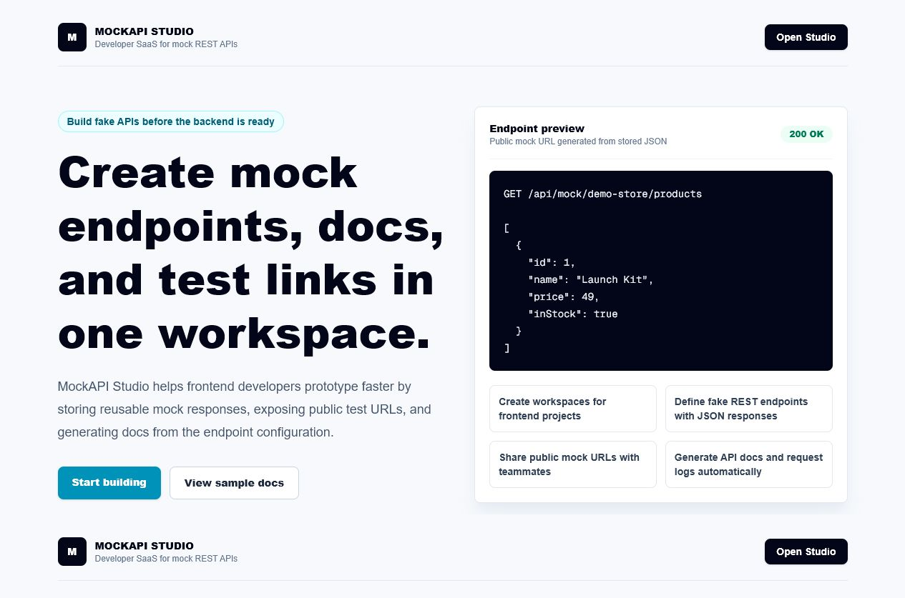

# MockAPI Studio

MockAPI Studio is a full-stack developer SaaS project where frontend developers can create fake REST API endpoints, store JSON responses, share public test URLs, view generated API docs, and inspect request history.


## Screenshots

| Landing Page | Studio Auth |
| --- | --- |
|  |  |

## Why This Exists

Frontend teams often wait for backend endpoints before they can finish screens, API states, loading flows, and error states. MockAPI Studio solves that by letting developers define mock endpoints in a workspace and instantly test them through public URLs.

Example:

```text
GET /api/mock/demo-store/products
```

Returns:

```json
[
  {
    "id": 1,
    "name": "Launch Kit",
    "price": 49,
    "inStock": true
  }
]
```

## Features

- User registration and login with cookie-based sessions.
- Workspace creation for projects or frontend features.
- Mock endpoint builder with method, path, status code, delay, and JSON response.
- Public mock endpoint runtime under `/api/mock/:workspaceSlug/:path`.
- Auto-generated public API docs for each workspace.
- Request history logs for tested endpoints.
- Optional local Ollama integration to generate sample JSON responses.
- MySQL schema and seed data for local development.
- Portfolio-ready product landing page and dashboard UI.

## Tech Stack

| Layer | Tools |
| --- | --- |
| Frontend | Next.js App Router, React, TypeScript, Tailwind CSS |
| Backend | Next.js Route Handlers |
| Database | MySQL with `mysql2` |
| Auth | Custom password hashing and signed HTTP-only cookie sessions |
| Optional AI | Local Ollama only, no paid API required |
| Tooling | ESLint, TypeScript, pnpm |

## Project Structure

```text
database/
  schema.sql             MySQL database schema
  seed.sql               Demo workspace and endpoint data
src/app/
  api/                   Auth, workspace, endpoint, mock runtime, Ollama APIs
  dashboard/             Authenticated studio interface
  docs/[workspaceSlug]/  Public generated API docs
  page.tsx               Product landing page
src/components/
  studio-client.tsx      Dashboard client UI
src/lib/
  auth.ts                Password hashing and session tokens
  db.ts                  MySQL connection pool
  mappers.ts             Database row to UI model mapping
  session.ts             Current-user lookup
  slug.ts                Workspace and endpoint path helpers
```

## Local Setup

### 1. Install dependencies

```bash
pnpm install
```

### 2. Configure environment

Copy `.env.example` to `.env.local`:

```bash
cp .env.example .env.local
```

Windows PowerShell:

```powershell
Copy-Item .env.example .env.local
```

Update MySQL values:

```env
DATABASE_HOST=localhost
DATABASE_PORT=3306
DATABASE_USER=your_mysql_username
DATABASE_PASSWORD=your_mysql_password
DATABASE_NAME=mockapi_studio
SESSION_SECRET=generate-a-long-random-string
OLLAMA_BASE_URL=http://localhost:11434
OLLAMA_MODEL=llama3.2
```

Security note:

- Keep real credentials only in `.env.local`.
- `.env.local` is ignored by Git and should never be committed.
- Do not use your MySQL `root` account for deployment. Create a project-specific MySQL user with only the permissions this app needs.
- If a real database password is ever pushed to GitHub, change that password immediately.

### 3. Create the database

Run this in MySQL:

```sql
SOURCE database/schema.sql;
SOURCE database/seed.sql;
```

The schema file resets the `mockapi_studio` database, so run it only when you want a fresh local database.

Demo login after seeding:

```text
Email: demo@mockapi.local
Password: password123
```

### 4. Start the app

```bash
pnpm dev
```

Open:

```text
http://localhost:3000
```

## Main User Flow

1. Register or log in.
2. Create a workspace such as `Demo Store`.
3. Create an endpoint such as `GET /products`.
4. Save a JSON response.
5. Test the generated URL:

```text
/api/mock/demo-store/products
```

6. View generated docs:

```text
/docs/demo-store
```

7. Inspect request history inside the dashboard.

## API Overview

| Method | Route | Purpose |
| --- | --- | --- |
| `POST` | `/api/auth/register` | Create account |
| `POST` | `/api/auth/login` | Login |
| `POST` | `/api/auth/logout` | Logout |
| `GET` | `/api/auth/me` | Current session |
| `GET` | `/api/workspaces` | List user workspaces |
| `POST` | `/api/workspaces` | Create workspace |
| `GET` | `/api/workspaces/:id/endpoints` | List endpoints |
| `POST` | `/api/workspaces/:id/endpoints` | Create endpoint |
| `PUT` | `/api/endpoints/:id` | Update endpoint |
| `DELETE` | `/api/endpoints/:id` | Delete endpoint |
| `GET` | `/api/workspaces/:id/logs` | Request history |
| `ANY` | `/api/mock/:workspaceSlug/:path` | Public mock endpoint |
| `POST` | `/api/ollama/sample` | Generate sample JSON using local Ollama |

## Optional Local LLM

This project does not use paid APIs. If Ollama is installed locally, the dashboard can call:

```text
http://localhost:11434/api/generate
```

The button "Generate with local Ollama" creates sample JSON for an endpoint description. If Ollama is not running, the rest of the app still works.

## Validation

```bash
pnpm typecheck
pnpm lint
pnpm build
```

## Deployment Notes

This is a full-stack app with MySQL, so it needs a host that supports:

- Node.js server runtime
- Environment variables
- A reachable MySQL database

Good free/local-first demo options:

- Run locally and record a demo video.
- Deploy the app to a Node-friendly platform with a free tier if available.
- Use a local MySQL database for live walkthroughs.

Avoid static-only hosts for the full app because the mock endpoint runtime and database APIs require a server.

## Resume Bullets

- Built a full-stack developer SaaS for creating mock REST APIs using Next.js, TypeScript, Tailwind CSS, and MySQL.
- Implemented authenticated workspaces, dynamic mock endpoint routing, generated API docs, request logging, and JSON response simulation.
- Added optional local Ollama integration to generate sample API JSON without relying on paid AI APIs.
- Designed a relational MySQL schema for users, workspaces, endpoints, and request logs with clean route-level access control.

## Status

Active build. Core product flows are implemented and committed in milestones.
